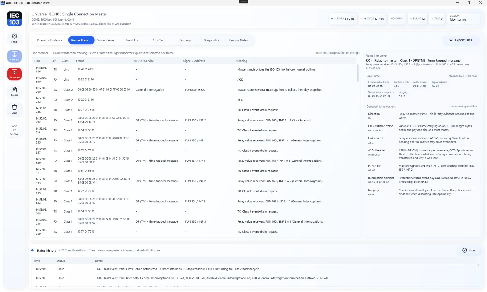
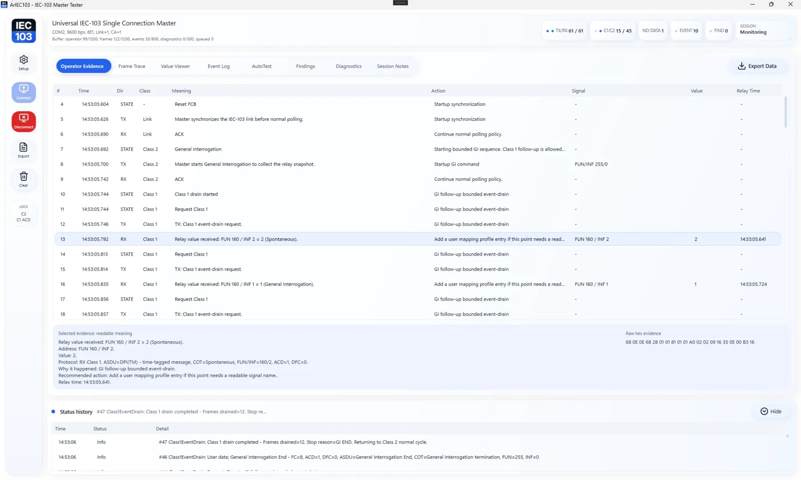
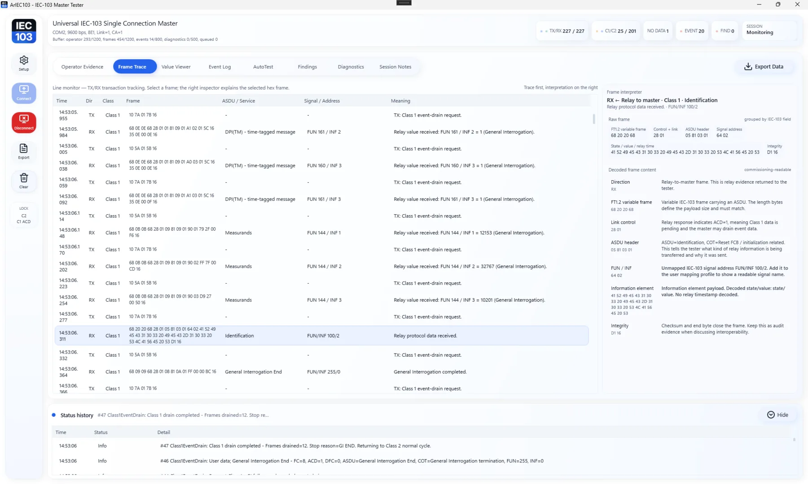
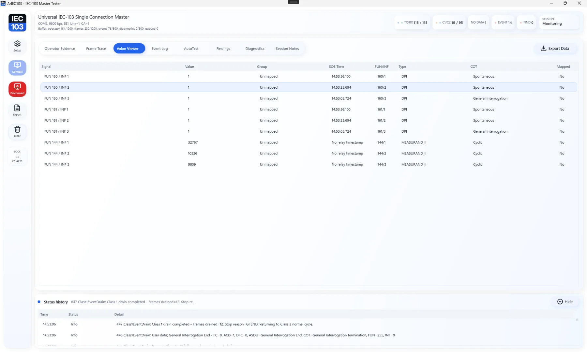
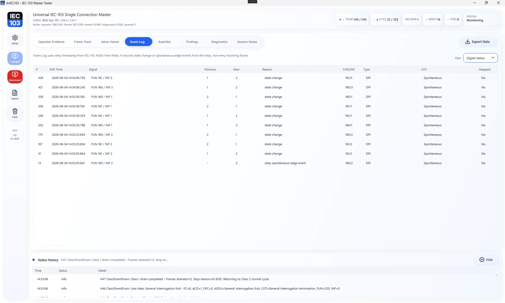

# ARIEC60870 Protocol Lab — IEC 60870-5-101 / 103 / 104 Evidence Analyzer

[](https://github.com/masarray/ARIEC60870/actions/workflows/ci.yml)
[](https://github.com/masarray/ARIEC60870/actions/workflows/pages.yml)
[](https://github.com/masarray/ARIEC60870/actions/workflows/release-package.yml)
[](https://scorecard.dev/viewer/?uri=github.com/masarray/ARIEC60870)
[](https://github.com/masarray/ARIEC60870/releases)
[](LICENSE)
[](#download)

**ARIEC60870 Protocol Lab** is a free, open-source Windows desktop tool for IEC 60870-5-101, IEC 60870-5-103, and IEC 60870-5-104 communication testing, protocol evidence review, FAT/SAT support, and commissioning troubleshooting.

The application runs a controlled master/client session, decodes protocol responses, shows readable engineering evidence, and keeps raw TX/RX frame detail available when deeper review is needed. It is designed for protection, SCADA, RTU, gateway, panel FAT, site acceptance, and substation automation teams.

No account required. The application source and built-in PDF report engine are released under the **Apache-2.0** license with no third-party PDF generation package dependency.

## Project status

- Current release line: **3.6.5**
- Primary platform: **Windows x64 desktop**
- Maturity: practical field-testing and commissioning support; active development
- Release package types: portable multi-file ZIP and optional single-file ZIP
- Public trust controls: Apache-2.0 licensing, clean-room policy, CodeQL, Dependabot, OpenSSF Scorecard workflow, release checksums, SBOM, and build provenance attestation


<p align="center">
  <a href="https://masarray.github.io/ARIEC60870/">
    
  </a>
</p>

## Why engineers use it

ARIEC60870 is built for practical protocol questions that appear during bench testing, panel FAT, troubleshooting, and commissioning:

- Is the IEC-101 serial, IEC-103 serial, or IEC-104 TCP endpoint responding?
- Did General Interrogation start, drain, and finish as expected?
- Are Class 1 events requested only when ACD indicates pending data?
- Are IEC-104 STARTDT, I-format, S-format, U-format, and TESTFR behavior visible?
- Which Type ID, COT, CA, IOA, FUN, INF, DPI/value, quality flag, and timestamp did the device send?
- Can the session evidence be exported for FAT/SAT notes, troubleshooting records, or handover?

The tool does not hide the protocol behind a black box. It presents readable evidence first, while preserving raw frame transparency for escalation.

## Download

Get the latest Windows release from GitHub Releases:

[Download latest release](https://github.com/masarray/ARIEC60870/releases/latest)

Typical assets:

```text
ARIEC60870-vX.Y.Z-win-x64-portable.zip
ARIEC60870-vX.Y.Z-win-x64-singlefile.zip
ARIEC60870-vX.Y.Z-sbom.spdx.json
SHA256SUMS.txt
```

First run:

1. Extract the ZIP to a local folder.
2. Run `Start-ARIEC60870.bat`.
3. Open **Setup**.
4. Select IEC-103 serial, IEC-101 serial, or IEC-104 TCP/IP.
5. Configure COM/TCP endpoint, address, timeout, GI option, and protocol interoperability profile.
6. Click **Start**.
7. Review **Operator Evidence**, **Value Viewer**, **Event Log**, **Frame Trace**, **Diagnostics**, and **Report**.
8. Export evidence after the test session.

## Screenshots

| Operator evidence | Setup overlay |
|---|---|
|  |  |

| Value and event review | Protocol visibility |
|---|---|
|  |  |

## Core capabilities

- IEC 60870-5-103 protection relay serial master workflow.
- IEC 60870-5-101 serial master workflow with FT1.2 frame evidence.
- IEC 60870-5-104 TCP client workflow with APCI/APDU visibility.
- General Interrogation, optional clock sync, controlled polling, and command/evidence workflow.
- ACD/DFC visibility for IEC-101/103 serial links.
- Type ID, VSQ, COT, CA, IOA, quality, timestamp, and value decoding for common IEC-101/104 ASDUs.
- FUN/INF/DPI/value/timestamp evidence for IEC-103 relay communication.
- Operator Evidence, Value Viewer, Event Log, Frame Trace, Diagnostics, Findings, and Report workspaces.
- User-owned JSON mapping profiles for readable project signal names.
- Professional PDF evidence report generated directly from the Report workspace by the built-in native PDF engine.
- Native PDF engine documented in [`docs/NATIVE_PDF_ENGINE.md`](docs/NATIVE_PDF_ENGINE.md).
- CLI support for IEC-103 master runs, offline trace analysis, and deterministic simulator checks.
- Sanitized protocol smoke tests and test vectors.

## Included in the release package

- Windows desktop protocol evidence analyzer.
- CLI tools.
- Internal demo/simulator flows for evaluation without field hardware.
- Example IEC-103 mapping profile.
- Example neutral IEC-101/104 IOA point profile.
- Quick Start, Troubleshooting, Validation Matrix, and Release Packaging notes.
- License, notices, and checksum file.

## Protocol coverage

ARIEC60870 is intentionally practical and evidence-oriented:

```text
IEC-103
  Serial master session, Class 1/Class 2 polling, reset link/FCB, GI, FUN/INF evidence,
  DPI/value decoding, relay timestamp visibility, and user mapping profile support.

IEC-101
  FT1.2 fixed/variable frames, unbalanced master workflow, Class 1/Class 2 polling,
  General Interrogation, optional clock sync, Type ID/COT/CA/IOA/value/quality evidence,
  and common monitoring/control ASDU visibility.

IEC-104
  TCP client session, STARTDT/STOPDT/TESTFR visibility, I/S/U frame evidence,
  sequence counters, General Interrogation, common ASDU decoding, and reportable findings.
```

## User-owned signal mapping

ARIEC60870 decodes protocol fields from the traffic. Readable project signal names come from user-owned JSON mapping profiles. This avoids guessed vendor naming and keeps evidence aligned with the approved project signal list.

Example IEC-103 mapping entry:

```json
{
  "schema": "ariec60870-mapping-profile-v1",
  "profileName": "Project A Feeder 01",
  "deviceName": "Relay Bay 01",
  "linkAddress": 1,
  "commonAddress": 1,
  "signals": [
    {
      "id": "bay01.breaker.position",
      "fun": 192,
      "inf": 36,
      "type": "DPI",
      "name": "Breaker Position",
      "group": "Switchgear",
      "stateMap": {
        "1": "Open",
        "2": "Closed"
      }
    }
  ]
}
```

## Build from source

Requirements:

- .NET 8 SDK
- Windows for the WPF desktop app
- Visual Studio 2022 or newer, or command-line `dotnet`

Build:

```bash
dotnet restore ARIEC60870.sln
dotnet build ARIEC60870.sln --configuration Release
```

Run desktop:

```bash
dotnet run --project src/ARIEC60870.Desktop
```

Run protocol smoke tests and xUnit regression suites:

```bash
dotnet run --project tests/ARIEC60870.Protocol.Tests/ARIEC60870.Protocol.Tests.csproj --configuration Release

dotnet test tests/ARIEC60870.Core.Tests/ARIEC60870.Core.Tests.csproj --configuration Release
dotnet test tests/ARIEC60870.Master.Tests/ARIEC60870.Master.Tests.csproj --configuration Release
dotnet test tests/ARIEC60870.Reporting.Tests/ARIEC60870.Reporting.Tests.csproj --configuration Release
dotnet test tests/ARIEC60870.Desktop.Tests/ARIEC60870.Desktop.Tests.csproj --configuration Release
dotnet test tests/ARIEC60870.Repository.Tests/ARIEC60870.Repository.Tests.csproj --configuration Release
```

Create release packages locally:

```powershell
pwsh ./scripts/publish-windows-portable.ps1 -Version 3.6.5
pwsh ./scripts/publish-windows-portable.ps1 -Version 3.6.5 -SingleFile
```

## Documentation

- [Quick Start](docs/QUICK_START.md)
- [Troubleshooting Guide](docs/TROUBLESHOOTING.md)
- [Architecture](docs/ARCHITECTURE.md)
- [Desktop Architecture Cleanup](docs/DESKTOP_ARCHITECTURE_CLEANUP.md)
- [Validation Matrix](docs/VALIDATION_MATRIX.md)
- [Testing Strategy](docs/TESTING_STRATEGY.md)
- [Release Packaging](docs/RELEASE_PACKAGING.md)
- [Roadmap](docs/ROADMAP.md)
- [Changelog](CHANGELOG.md)
- [Test Suite](tests/README.md)
- [Test Vectors](samples/test-vectors/README.md)

## Product boundary

ARIEC60870 is a single-connection protocol evidence analyzer. It is not a vendor-specific relay database, not a SCADA gateway, not a redundant master station, and not a replacement for formal FAT/SAT procedures.

Validate each release with the target device, project communication settings, and approved project mapping profile before relying on exported evidence for contractual records.

## Security and privacy

Protocol traces and exported reports may contain project names, station labels, communication addresses, serial/TCP settings, and raw frame evidence. Review exported files before sharing them outside the project team.

Please report security issues using [SECURITY.md](SECURITY.md).

## Contributing

Contributions are welcome when they preserve the clean-room Apache-2.0 boundary. Start with [CONTRIBUTING.md](CONTRIBUTING.md), open an issue with a focused reproduction, and include sanitized test vectors when possible.

## License

ARIEC60870 is free and open source under the **Apache License, Version 2.0**. See [LICENSE](LICENSE), [NOTICE](NOTICE), and [THIRD_PARTY_NOTICES.md](THIRD_PARTY_NOTICES.md).


See [GitHub security automation](docs/GITHUB_SECURITY_AUTOMATION.md) for Dependabot and OpenSSF Scorecard configuration.
