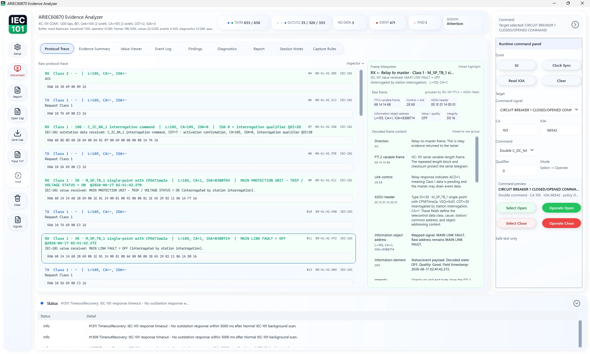
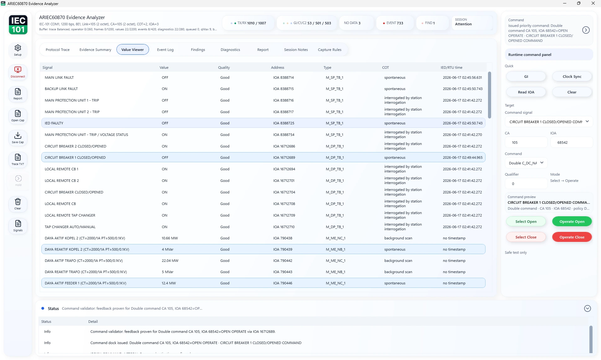
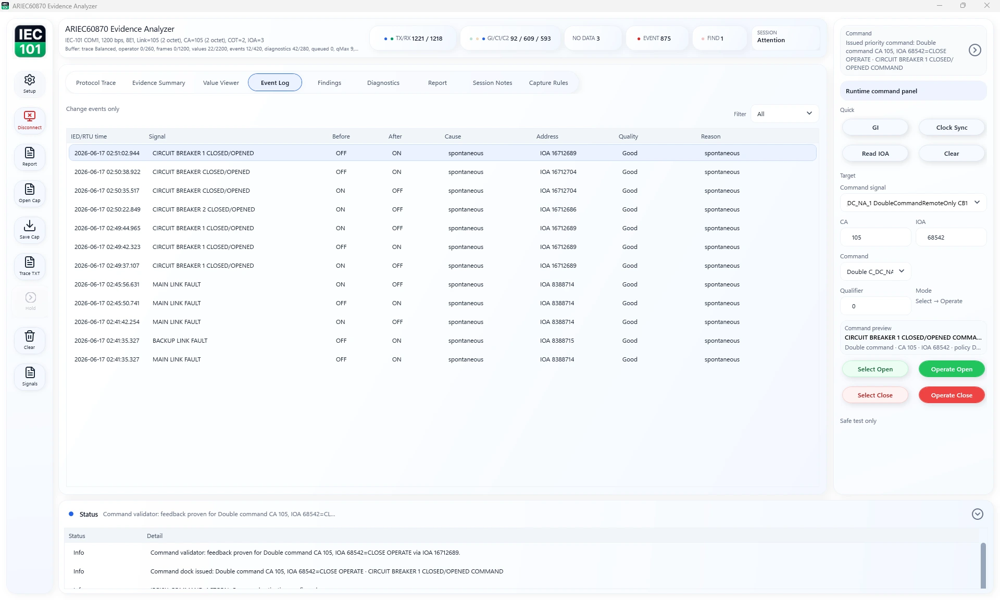
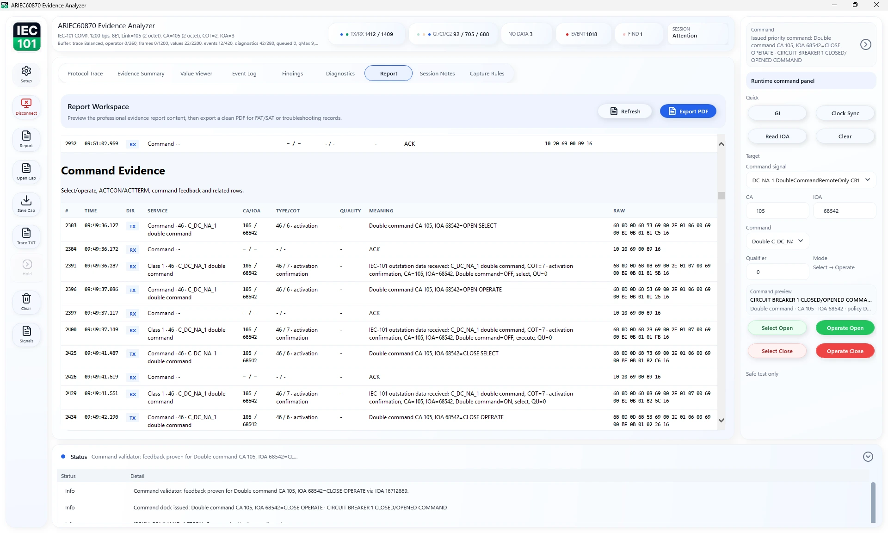

# ARIEC60870 Evidence Analyzer

[](https://github.com/masarray/ARIEC60870/actions/workflows/ci.yml)
[](https://github.com/masarray/ARIEC60870/actions/workflows/pages.yml)
[](https://github.com/masarray/ARIEC60870/actions/workflows/release-package.yml)
[](LICENSE)
[](#download-and-run)

**ARIEC60870 Evidence Analyzer** is a free Apache-2.0 Windows desktop application for authorized IEC 60870-5-101, IEC 60870-5-103, and IEC 60870-5-104 evidence review, FAT/SAT preparation, commissioning checks, and troubleshooting records.

The app helps engineers run a focused communication session, review decoded evidence, inspect protocol details, and export a professional PDF report. It is intended for authorized engineering environments only.

- Product website and user guide hub: [masarray.github.io/ARIEC60870](https://masarray.github.io/ARIEC60870/)
- Latest release: [download the Windows ZIP](https://github.com/masarray/ARIEC60870/releases/latest)

<p align="center">
  <a href="https://masarray.github.io/ARIEC60870/">
    
  </a>
</p>

## Website and user guide hub

Start with the website when you want the user-facing product explanation, download path, and short wiki pages:

- [Product website](https://masarray.github.io/ARIEC60870/) — product purpose, features, use cases, screenshots, license notes, and download CTA.
- [Quick Start](https://masarray.github.io/ARIEC60870/quick-start.html) — download, run, configure, review evidence, export PDF.
- [Download Guide](https://masarray.github.io/ARIEC60870/download.html) — release asset, package contents, and integrity files.
- [Protocol Coverage](https://masarray.github.io/ARIEC60870/protocol-coverage.html) — IEC-101, IEC-103, and IEC-104 evidence workflows.
- [Troubleshooting](https://masarray.github.io/ARIEC60870/troubleshooting.html) — no response, GI gaps, serial/TCP checks, mapping issues, and report review.
- [FAQ](https://masarray.github.io/ARIEC60870/faq.html) — license, commercial use, protocol support, current scope, and safe use boundaries.

## What it is for

Use ARIEC60870 when you need to:

- check a single IEC-101, IEC-103, or IEC-104 endpoint in a controlled test environment;
- validate IEC-101 dual-link active/standby redundancy behavior with a dedicated workspace;
- confirm startup communication and General Interrogation behavior;
- review decoded values, events, diagnostics, and protocol evidence;
- use project-owned mapping profiles for readable signal names;
- export a professional PDF evidence report for review, FAT/SAT notes, or handover.

ARIEC60870 is not a production SCADA system, not a gateway, not a production redundant master station, and not a replacement for an approved project test procedure.

## Download and run

1. Open the latest release page:

   [Download latest release](https://github.com/masarray/ARIEC60870/releases/latest)

2. Download this Windows asset:

   ```text
   ARIEC60870-vX.Y.Z-win-x64.zip
   ```

3. Extract the ZIP to a local folder.
4. Double-click:

   ```text
   ARIEC60870.exe
   ```

The user release is intentionally simple: one self-contained desktop EXE in the package, with no start batch file required.

Release integrity files are also published:

```text
ARIEC60870-vX.Y.Z-sbom.spdx.json
SHA256SUMS.txt
```

## First use

1. Open **Setup**.
2. Select the protocol mode: **IEC-101 serial**, **IEC-101 Dual Link Redundancy**, **IEC-103 serial**, or **IEC-104 TCP/IP**.
3. Enter the project-approved communication settings for the test device.
4. Enable **General Interrogation** when a startup snapshot is needed.
5. Load a mapping profile if readable signal names are required.
6. Click **Start**.
7. Review **Operator Evidence**, **Value Viewer**, **Event Log**, **Frame Trace**, **Diagnostics**, and **Report**.
8. Open **Report** and click **Export PDF** when the evidence is ready.

For a fuller walkthrough, read the [User Guide](docs/USER_GUIDE.md), [Quick Start](docs/QUICK_START.md), or the [user website](https://masarray.github.io/ARIEC60870/).

## Connection overview

### IEC-104 TCP/IP

Use **IEC-104 TCP/IP** for authorized endpoint checks over a TCP connection. Enter the server address, TCP port, common address, and ASDU profile values from the device or project interoperability document.

### IEC-101 serial

Use **IEC-101 serial** for serial RTU or gateway checks. Select the COM port and enter the approved serial settings, link address, common address, and ASDU size profile.

### IEC-101 Dual Link Redundancy

Use **IEC-101 Dual Link Redundancy** when the RTU/outstation exposes two independent IEC-101 serial paths. Link A and Link B use separate transports and link-layer state. Only the active link owns General Interrogation, commands, Class 1 drain, and Class 2 background polling; the standby link is supervised without draining event queues. The dedicated workspace includes manual switchover proof and active-link GI actions for FAT/SAT evidence.

### IEC-103 serial

Use **IEC-103 serial** for protection relay communication checks. Select the COM port and enter the approved serial settings, link address, polling/timing values, and optional mapping profile.

## Export a PDF report

1. Run a session or open a saved capture.
2. Open **Report**.
3. Click **Refresh** if the preview is not current.
4. Click **Export PDF**.
5. Choose the output file name and folder.
6. Review the generated PDF before sharing it.

The PDF is generated directly by the built-in native PDF engine. No external PDF conversion workflow is required.

## Screenshots

| Evidence workspace | Value Viewer |
|---|---|
|  |  |

| Event Log | Report workspace |
|---|---|
|  |  |

## Core capabilities

- IEC 60870-5-101 serial evidence workflow.
- IEC 60870-5-101 Dual Link Redundancy workspace with active-only command/GI/Class polling, supervised standby, failover journal, and post-switch GI evidence.
- IEC 60870-5-103 serial relay evidence workflow.
- IEC 60870-5-104 TCP/IP evidence workflow.
- Startup communication, General Interrogation, value, event, diagnostic, and frame review.
- User-owned JSON mapping profiles for readable project signal names.
- Professional PDF evidence report generated by the built-in native PDF engine.
- Sanitized protocol smoke tests and xUnit regression suites.

## Included in the user release package

- `ARIEC60870.exe` — the Windows desktop application.
- `README_RELEASE.txt` — short first-run instructions.
- `docs/` — User Guide, Quick Start, Troubleshooting, Validation Matrix, and Release Packaging notes.
- `samples/` and `profiles/` — neutral example files.
- `LICENSE`, `NOTICE`, `THIRD_PARTY_NOTICES.md`, `CHANGELOG.md`.

## License and commercial use

ARIEC60870 is licensed under [Apache-2.0](LICENSE). It may be used in internal and commercial engineering workflows, subject to the Apache-2.0 license terms, organization policy, customer/project rules, and the approved test environment.

Commercial or internal use does not remove the need to validate exported evidence, follow the approved project procedure, and protect sensitive project information before sharing reports.

## Build from source

Requirements:

- .NET 8 SDK
- Windows for the WPF desktop app
- Visual Studio 2022 or newer, or command-line `dotnet`

Build:

```bash
dotnet restore ARIEC60870.sln
dotnet build ARIEC60870.sln --configuration Release
```

Run desktop:

```bash
dotnet run --project src/ARIEC60870.Desktop
```

Run tests:

```bash
dotnet test ARIEC60870.sln --configuration Release
```

Create the user release package locally:

```powershell
pwsh ./scripts/publish-windows-portable.ps1
```

The local packaging script reads the repository version by default and runs the same release checks unless `-SkipTests` is explicitly used for local experiments.

## Documentation

- [Documentation Map](docs/README.md)
- [User Guide](docs/USER_GUIDE.md)
- [Quick Start](docs/QUICK_START.md)
- [IEC-101 Dual Link FAT Checklist](docs/IEC101_DUAL_LINK_FAT_CHECKLIST.md)
- [Troubleshooting Guide](docs/TROUBLESHOOTING.md)
- [Architecture](docs/ARCHITECTURE.md)
- [Native PDF Engine](docs/NATIVE_PDF_ENGINE.md)
- [Validation Matrix](docs/VALIDATION_MATRIX.md)
- [Testing Strategy](docs/TESTING_STRATEGY.md)
- [Release Packaging](docs/RELEASE_PACKAGING.md)
- [Roadmap](docs/ROADMAP.md)
- [Changelog](CHANGELOG.md)
- [Test Suite](tests/README.md)

## Security and privacy

Protocol traces and exported reports may contain project names, station labels, communication addresses, mapping labels, and evidence details. Review exported files before sharing them outside the project team.

Please report security issues using [SECURITY.md](SECURITY.md).
