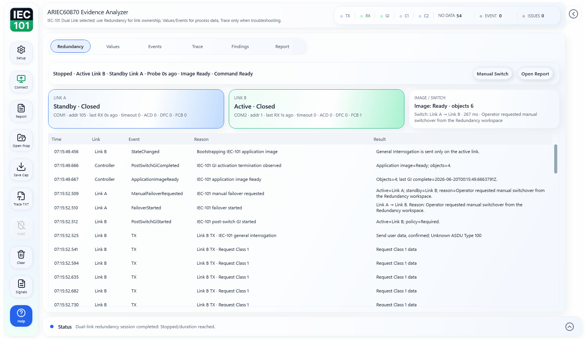

# ARIEC60870 Protocol Tester & Evidence Analyzer

[](https://github.com/masarray/ARIEC60870/actions/workflows/ci.yml)
[](https://github.com/masarray/ARIEC60870/actions/workflows/pages.yml)
[](https://github.com/masarray/ARIEC60870/actions/workflows/release-package.yml)
[](LICENSE)
[](#download-and-run)

**ARIEC60870** is a **100% free, Apache-2.0 open-source Windows IEC 60870 protocol tester and evidence analyzer** for authorized IEC 60870-5-101, IEC 60870-5-103, and IEC 60870-5-104 engineering work. It can be used for learning, academic research, internal engineering, FAT/SAT, commissioning support, troubleshooting, vendor evaluation, and commercial activities without a license key, account, subscription, or activation server.

Unlike a basic protocol tester that only shows pass/fail status or raw frames, ARIEC60870 keeps the raw TX/RX hex evidence visible, explains what the selected frame means in readable engineering language, records values and events, highlights likely issues with **Smart Findings**, and exports a clean PDF evidence report for FAT, SAT, commissioning, troubleshooting, homologation support, certification attachments, vendor evaluation, and technical handover.

> **From raw hex to root cause.** Test IEC 60870, understand the frame, diagnose likely communication issues, and export the evidence.

- Product website and user guide hub: [masarray.github.io/ARIEC60870](https://masarray.github.io/ARIEC60870/)
- Latest release: [download the Windows ZIP](https://github.com/masarray/ARIEC60870/releases/latest)
- Demo flow: [watch the GIF walkthrough](https://masarray.github.io/ARIEC60870/demo.html)
- Evidence-focused alias: **ARIEC60870 Evidence Analyzer**.

<p align="center">
  <a href="https://masarray.github.io/ARIEC60870/demo.html">
    
  </a>
</p>

## 30-second demo: raw frame → finding → report

The demo shows the product story that makes ARIEC60870 different from a basic protocol tester:

1. connect to an IEC 101, IEC 103, or IEC 104 endpoint in an authorized test session;
2. capture TX/RX protocol evidence;
3. inspect the selected raw frame with readable interpretation;
4. review values, events, and Smart Findings;
5. export a native PDF evidence report for project records.

This flow is designed for engineers who need to explain **what happened**, **where the proof is**, and **what should be checked next** without writing repetitive paperwork from scratch.

## See what the device is really saying

A basic protocol analyzer can show a frame. ARIEC60870 is designed to help the engineer understand what the frame means, why it matters, and how it can be used as evidence.

```text
TX 68 0E 00 00 00 00 64 01 06 00 01 00 00 00 14
```

ARIEC60870 connects that raw traffic to a readable engineering explanation:

```text
Direction: TX
Protocol: IEC 60870-5-104
Frame: I-frame carrying ASDU data
Type: C_IC_NA_1 General Interrogation command
Cause of transmission: Activation
Common Address: 1
Meaning: The master requests a startup snapshot from the device.
Evidence use: Include this frame when proving GI was initiated during FAT/SAT or troubleshooting.
```

Then Smart Findings can connect symptoms to likely causes:

```text
Problem: Device answered but the ASDU Common Address does not match the expected profile.
Proof: RX frame shows CA=2 while the test setup expects CA=1.
Likely cause: Wrong station address, wrong profile, or connected endpoint is not the expected device.
Next step: Verify CA in device configuration, project documentation, and ARIEC60870 setup.
```

## Why engineers use it instead of a basic protocol tester

| Basic protocol tester | ARIEC60870 |
|---|---|
| Shows raw frames or pass/fail status | Shows raw TX/RX frames and selected-frame interpretation |
| Error messages can be hard for new users | Smart Findings explain problem, proof, likely cause, and next step |
| Manual notes are needed after testing | Native PDF evidence report reduces repetitive paperwork |
| Hard to teach juniors from raw traffic alone | Field Wiki connects protocol concepts to real evidence |
| Troubleshooting often stops at “no response” | Helps check CA, IOA, GI, ACTCON, ACTTERM, Class 1, quality, and IEC-104 session symptoms |

## Shareable evidence assets

Use these pages when explaining the tool to engineers, vendors, QA teams, or project stakeholders:

- [Demo walkthrough](https://masarray.github.io/ARIEC60870/demo.html) — the GIF story: connect, interpret, find, report.
- [Sample IEC-104 trace](https://masarray.github.io/ARIEC60870/examples/iec104-ca-mismatch-sample-trace.txt) — sanitized text trace for learning and documentation.
- [PDF Evidence Report](https://masarray.github.io/ARIEC60870/iec60870-pdf-evidence-report.html) — how evidence output supports FAT/SAT, commissioning, troubleshooting, homologation, certification attachment, vendor comparison, and handover.

## Website and user guide hub

Start with the website when you want the user-facing product explanation, download path, and short wiki pages:

- [Product website](https://masarray.github.io/ARIEC60870/) — product purpose, features, use cases, screenshots, license notes, and download CTA.
- [Quick Start](https://masarray.github.io/ARIEC60870/quick-start.html) — download, run, configure, review evidence, export PDF.
- [Download Guide](https://masarray.github.io/ARIEC60870/download.html) — release asset, package contents, and integrity files.
- [Protocol Coverage](https://masarray.github.io/ARIEC60870/protocol-coverage.html) — IEC-101, IEC-103, and IEC-104 evidence workflows.
- [Field Wiki](https://masarray.github.io/ARIEC60870/wiki.html) — ACD, DFC, Class 1/Class 2, GI, command flow, addressing, IEC-104 session control, and relay events.
- [Smart Findings](https://masarray.github.io/ARIEC60870/smart-findings.html) — problem, proof, likely cause, and next step from protocol symptoms.
- [Troubleshooting](https://masarray.github.io/ARIEC60870/troubleshooting.html) — no response, CA mismatch, GI gaps, serial/TCP checks, mapping issues, and report review.
- [Common Address mismatch](https://masarray.github.io/ARIEC60870/iec60870-common-address-mismatch.html) — why a device can answer but still use the wrong ASDU CA.
- [General Interrogation incomplete](https://masarray.github.io/ARIEC60870/iec101-general-interrogation-incomplete.html) — how to read GI gaps from trace and event evidence.
- [ACTCON missing](https://masarray.github.io/ARIEC60870/iec60870-command-actcon-missing.html) — command confirmation troubleshooting for IEC 101/104 style workflows.
- [IEC-104 sequence/session issues](https://masarray.github.io/ARIEC60870/iec104-sequence-counter-mismatch.html) — STARTDT, TESTFR, I/S-frame acknowledgement, and sequence behavior.
- [PDF Evidence Report](https://masarray.github.io/ARIEC60870/iec60870-pdf-evidence-report.html) — FAT/SAT, commissioning, troubleshooting, homologation, certification attachment, and handover evidence.
- [FAQ](https://masarray.github.io/ARIEC60870/faq.html) — license, commercial use, protocol support, current scope, and safe use boundaries.

## What it is for

Use ARIEC60870 when you need an IEC 60870 protocol tester that can also explain and package the evidence:

- check a single IEC-101, IEC-103, or IEC-104 endpoint in a controlled test environment;
- validate IEC-101 dual-link active/standby redundancy behavior with a dedicated workspace;
- confirm startup communication, IEC-104 session control, and General Interrogation behavior;
- inspect raw TX/RX hex frames with selected-frame interpretation instead of reading hex manually;
- review decoded values, SOE-style events, diagnostics, quality flags, timestamps, and protocol evidence;
- use Smart Findings to connect symptoms such as CA mismatch, unknown IOA, GI gaps, Class 1 congestion, command timeout, bad quality, or unstable session behavior to likely causes and practical next steps;
- use project-owned mapping profiles for readable signal names while keeping raw addresses traceable;
- export a professional PDF evidence report for FAT/SAT notes, commissioning records, troubleshooting escalation, homologation support, certification attachments, beauty contest/vendor comparison, or handover.

ARIEC60870 is not a production SCADA system, not a gateway, not a production redundant master station, not a certified conformance test suite, and not a replacement for an approved project test procedure.

## Download and run

1. Open the latest release page:

   [Download latest release](https://github.com/masarray/ARIEC60870/releases/latest)

2. Download this Windows asset:

   ```text
   ARIEC60870-vX.Y.Z-win-x64.zip
   ```

3. Extract the ZIP to a local folder.
4. Double-click:

   ```text
   ARIEC60870.exe
   ```

The user release is intentionally simple: one self-contained desktop EXE in the package, with no start batch file required.

Release integrity files are also published:

```text
ARIEC60870-vX.Y.Z-sbom.spdx.json
SHA256SUMS.txt
```

## First use

1. Open **Setup**.
2. Select the protocol mode: **IEC-101 serial**, **IEC-101 Dual Link Redundancy**, **IEC-103 serial**, or **IEC-104 TCP/IP**.
3. Enter the project-approved communication settings for the test device.
4. Enable **General Interrogation** when a startup snapshot is needed.
5. Load a mapping profile if readable signal names are required.
6. Click **Start**.
7. Review the focused workspaces: **Redundancy** when using dual-link IEC-101, then **Values**, **Events**, **Trace**, **Smart Findings**, and **Report**.
8. Use **Trace** to inspect raw TX/RX hex and selected-frame meaning when the decoded view is not enough.
9. Open **Report** and click **Export PDF** when the evidence is ready.

For a fuller walkthrough, read the [User Guide](docs/USER_GUIDE.md), [Quick Start](docs/QUICK_START.md), or the [user website](https://masarray.github.io/ARIEC60870/).

## Connection overview

### IEC-104 TCP/IP

Use **IEC-104 TCP/IP** for authorized endpoint checks over a TCP connection. Enter the server address, TCP port, common address, and ASDU profile values from the device or project interoperability document.

### IEC-101 serial

Use **IEC-101 serial** for serial RTU or gateway checks. Select the COM port and enter the approved serial settings, link address, common address, and ASDU size profile.

### IEC-101 Dual Link Redundancy

Use **IEC-101 Dual Link Redundancy** when the RTU/outstation exposes two independent IEC-101 serial paths. Link A and Link B use separate transports and link-layer state. Only the active link owns General Interrogation, commands, Class 1 drain, and Class 2 background polling; the standby link is supervised without draining event queues. The release workspace is intentionally compact: **Redundancy** for active/standby ownership and switch proof, **Values** for the logical RTU image, **Events** for SOE/process events, **Trace** for telegram troubleshooting, **Smart Findings** for likely protocol problems, and **Report** for FAT/SAT proof.

### IEC-103 serial

Use **IEC-103 serial** for protection relay communication checks. Select the COM port and enter the approved serial settings, link address, polling/timing values, and optional mapping profile.

## Export a PDF report

1. Run a session or open a saved capture.
2. Open **Report**.
3. Click **Refresh** if the preview is not current.
4. Click **Export PDF**.
5. Choose the output file name and folder.
6. Review the generated PDF before sharing it.

The PDF is generated directly by the built-in native PDF engine. No external PDF conversion workflow is required.
